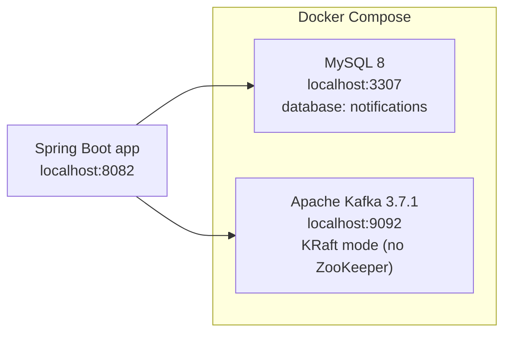
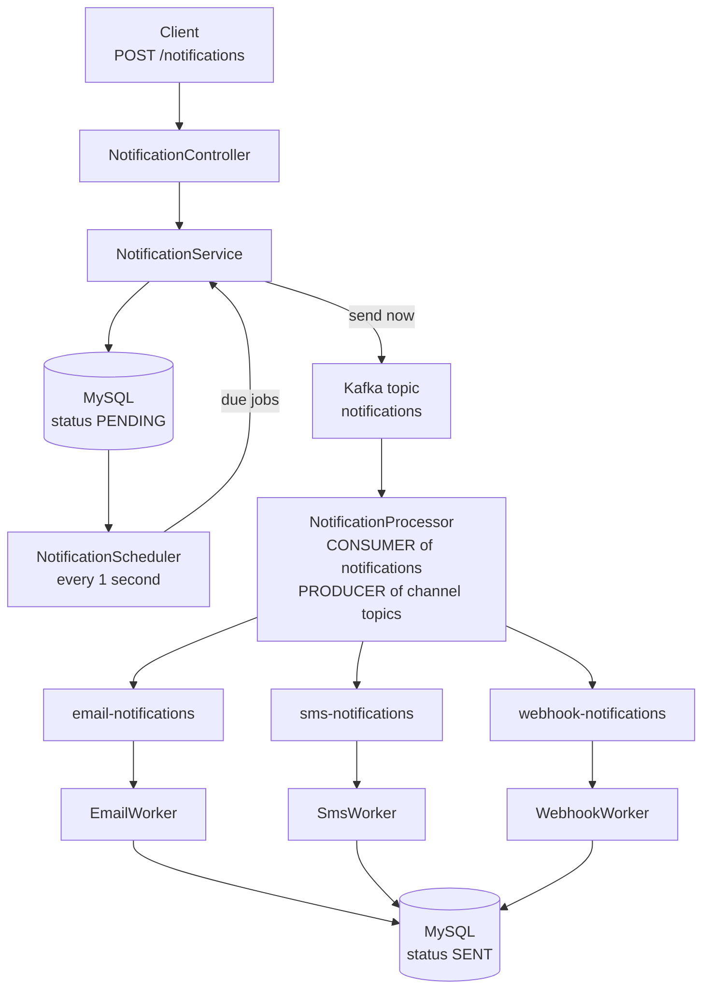

# Notification System — beginner guide
This project is a small **notification platform**. A client (another app, or you with `curl`) sends a request like “email user 50”. The API **does not send the email immediately**. It saves the job in **MySQL**, puts a message on **Kafka**, and background **workers** finish the send.
Think of it like a restaurant:
| Real life | This system |
|-----------|-------------|
| You place an order | `POST /notifications` |
| Kitchen ticket is written down | Row in MySQL (`PENDING`) |
| Ticket goes on a conveyor | Kafka topic |
| Cooks pick up tickets | Processor + workers |
| Dish is served | Status becomes `SENT` |
You do **not** need to be a Kafka expert. Read this file top to bottom.
---
## What you need on your computer
- **Java 17**
- **Maven** (or your IDE’s Maven)
- **Docker Desktop** (for MySQL + Kafka)
The Spring Boot app is **one process**. MySQL and Kafka run in **Docker**.
---
## Folder map
```
Notification-System/
├── docker-compose.yml          ← starts MySQL and Kafka
├── README.md                   ← this file
└── notification-service/       ← the Java application
    ├── pom.xml
    └── src/main/java/com/notificationsystem/notificationservice/
        ├── NotificationServiceApplication.java   ← start here
        ├── controller/     ← HTTP API
        ├── service/        ← create + publish + mark SENT
        ├── processor/      ← Kafka router (notifications → channel topics)
        ├── worker/         ← email / SMS / webhook consumers
        ├── scheduler/      ← timer for future notifications
        ├── config/         ← creates Kafka topics
        ├── domain/         ← MySQL table mapping
        ├── repository/     ← SQL access
        ├── event/          ← Kafka message shape
        ├── dto/            ← HTTP JSON shape
        └── model/          ← enums (EMAIL/SMS/WEBHOOK, statuses)
```
---
## Pieces of the system (infrastructure)
These are **not** Java classes. They are programs started by Docker.

| Service | Image | Port on your PC | What it stores / does |
|---------|--------|-----------------|------------------------|
| **MySQL** | `mysql:8.0` | `3307` → container `3306` | The `notifications` table: who, what, when, status |
| **Kafka** | `apache/kafka:3.7.1` | `9092` | Topics (mailboxes). Messages wait here until consumers read them |
Credentials (from `docker-compose.yml` and `application.yml`):
- Database: `notifications`
- User: `notification` / password: `notification`
- Root password: `root` (only if you log in as root)
Kafka uses **KRaft** (`KAFKA_PROCESS_ROLES: broker,controller`). There is **no ZooKeeper** in this project.
---
## How a notification travels (big picture)

**Immediate send** (`scheduledAt` missing or already in the past):
1. HTTP request arrives.
2. Row saved as `PENDING`, then claimed as `PROCESSING`.
3. Event published to topic `notifications`.
4. Processor copies it to the matching channel topic.
5. Worker prints a fake “sent” line and marks the row `SENT`.
**Scheduled send** (`scheduledAt` is in the future):
1. HTTP request arrives.
2. Row saved as `PENDING`. **No Kafka message yet.**
3. Every second the scheduler looks for due `PENDING` rows.
4. When time arrives, it calls the same `publish()` method as step 3 above.
The API always returns **HTTP 202 Accepted** (“we received it; sending happens later”).
---
## Kafka for beginners
### Topic
A **topic** is a named mailbox. Producers put messages in. Consumers take them out.
This app creates **four** topics (`KafkaTopicConfig`):
| Topic name | Role |
|------------|------|
| `notifications` | First mailbox. Every job lands here (after it is due). |
| `email-notifications` | Only email jobs. |
| `sms-notifications` | Only SMS jobs. |
| `webhook-notifications` | Only webhook jobs. |
Why not one topic? So you can scale **email workers** independently from **SMS workers**. The processor is a **router**.
Each topic has **3 partitions** and **1 replica** (learning setup). Partitions let several consumers in the **same group** share work. One replica is enough on a laptop; production would use more copies.
### Producer vs consumer
- **Producer** = code that **writes** to Kafka (`kafkaTemplate.send(...)`).
- **Consumer** = code that **reads** from Kafka (`@KafkaListener`).
The **same Java app** is both: it produces after the API/scheduler, and it consumes in the processor and workers.
### Kafka key
Messages are sent with **key = `userId`**. Same user always goes to the same partition, so that user’s notifications stay **in order**.
### Consumer group
`groupId` is a **team name**.
- Several instances with the **same** `groupId` **share** messages (each message handled once by that team).
- Different `groupId`s each get their **own copy** of the stream.
That is why the processor and the email worker must **not** share a group: they listen to **different topics**, and they are different teams.
### The Kafka message (payload)
