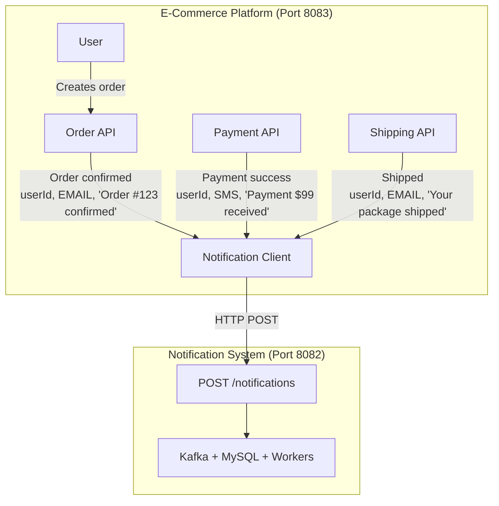

# E-Commerce Platform - Notification System Integration

This is a **demonstration e-commerce platform** that integrates with the **Notification System** as a black box. It shows how any application can send notifications through your notification system without knowing its internal implementation details.

## Architecture Overview



## Key Features

- **Black Box Integration**: E-commerce platform only knows the HTTP API endpoint
- **Asynchronous Notifications**: All notifications are sent via HTTP 202 Accepted
- **Multiple Channels**: Supports EMAIL, SMS, and WEBHOOK notifications
- **Automatic Notifications**: Triggers notifications on order creation, payment, shipping, and delivery

## Prerequisites

- **Java 17**
- **Maven**
- **Notification System** running on `localhost:8082`
  - Start it first: `cd ../Notification-System && docker-compose up -d`
  - Then run: `mvn spring-boot:run` (from notification-service directory)

## Project Structure

```
e-commerce-platform/
├── pom.xml
├── src/main/java/com/ecommerce/platform/
│   ├── EcommercePlatformApplication.java
│   ├── config/
│   │   └── RestTemplateConfig.java
│   ├── client/
│   │   └── NotificationClient.java          ← Black box integration
│   ├── controller/
│   │   ├── OrderController.java
│   │   ├── PaymentController.java
│   │   └── ShipmentController.java
│   ├── domain/
│   │   ├── Order.java
│   │   ├── Payment.java
│   │   └── Shipment.java
│   ├── dto/
│   │   ├── NotificationChannel.java
│   │   ├── NotificationRequest.java
│   │   ├── OrderRequest.java
│   │   ├── PaymentRequest.java
│   │   └── ShipmentRequest.java
│   ├── model/
│   │   ├── OrderStatus.java
│   │   ├── PaymentStatus.java
│   │   └── ShipmentStatus.java
│   ├── repository/
│   │   ├── OrderRepository.java
│   │   ├── PaymentRepository.java
│   │   └── ShipmentRepository.java
│   └── service/
│       ├── OrderService.java
│       ├── PaymentService.java
│       └── ShipmentService.java
└── src/main/resources/
    └── application.yml
```

## How to Run

1. **Start the Notification System** (if not already running):
   ```bash
   cd ../Notification-System
   docker-compose up -d
   cd notification-service
   mvn spring-boot:run
   ```

2. **Start the E-Commerce Platform**:
   ```bash
   cd e-commerce-platform
   mvn spring-boot:run
   ```

The platform will start on `http://localhost:8083`

## API Documentation

### Order API

| Endpoint | Method | Description | Notification Sent |
|----------|--------|-------------|-------------------|
| `/api/orders` | POST | Create a new order | EMAIL: Order confirmation |
| `/api/orders/{id}/ship` | POST | Mark order as shipped | EMAIL: Shipping notification |
| `/api/orders/{id}/deliver` | POST | Mark order as delivered | SMS: Delivery notification |
| `/api/orders/{id}` | GET | Get order details | None |

**Create Order Request:**
```json
{
  "userId": 50,
  "totalAmount": 99.99
}
```

**Response:**
```json
{
  "id": 1,
  "userId": 50,
  "orderNumber": "ORD-A1B2C3D4",
  "totalAmount": 99.99,
  "status": "PENDING",
  "createdAt": "2026-09-14T18:00:00",
  "shippedAt": null,
  "deliveredAt": null
}
```

### Payment API

| Endpoint | Method | Description | Notification Sent |
|----------|--------|-------------|-------------------|
| `/api/payments` | POST | Create a payment | SMS: Payment success |
| `/api/payments/{id}` | GET | Get payment details | None |

**Create Payment Request:**
```json
{
  "userId": 50,
  "orderId": 1,
  "amount": 99.99,
  "paymentMethod": "CREDIT_CARD"
}
```

### Shipment API

| Endpoint | Method | Description | Notification Sent |
|----------|--------|-------------|-------------------|
| `/api/shipments` | POST | Create a shipment | EMAIL: Package prepared |
| `/api/shipments/{id}/ship` | POST | Mark package as shipped | SMS: Package shipped |
| `/api/shipments/{id}/deliver` | POST | Mark package as delivered | EMAIL: Package delivered |
| `/api/shipments/{id}` | GET | Get shipment details | None |

**Create Shipment Request:**
```json
{
  "userId": 50,
  "orderId": 1,
  "shippingAddress": "123 Main St, City, Country"
}
```

## Integration Details

### NotificationClient (Black Box)

The `NotificationClient` class is the only component that knows about the notification system:

```java
@Component
public class NotificationClient {
    
    private final RestTemplate restTemplate;
    private final String notificationServiceUrl;
    
    public void sendNotification(Long userId, NotificationChannel channel, String message) {
        NotificationRequest request = new NotificationRequest();
        request.setUserId(userId);
        request.setChannel(channel);
        request.setMessage(message);
        
        restTemplate.postForObject(notificationServiceUrl, request, Void.class);
    }
}
```

**Key Points:**
- The e-commerce platform doesn't know about Kafka, MySQL, or workers
- It only sends HTTP POST requests to the notification system
- If the notification system is down, it logs an error but doesn't break the e-commerce flow
- The notification system handles all the complexity asynchronously

### Configuration

The notification system URL is configured in `application.yml`:

```yaml
notification:
  service:
    url: http://localhost:8082
    endpoint: /notifications
```

## Example Workflow

1. **User places an order**:
   ```bash
   curl -X POST http://localhost:8083/api/orders \
     -H "Content-Type: application/json" \
     -d '{"userId": 50, "totalAmount": 99.99}'
   ```
   → Notification sent: EMAIL "Order #ORD-A1B2C3D4 confirmed!"

2. **Payment is processed**:
   ```bash
   curl -X POST http://localhost:8083/api/payments \
     -H "Content-Type: application/json" \
     -d '{"userId": 50, "orderId": 1, "amount": 99.99, "paymentMethod": "CREDIT_CARD"}'
   ```
   → Notification sent: SMS "Payment of $99.99 received successfully"

3. **Order is shipped**:
   ```bash
   curl -X POST http://localhost:8083/api/orders/1/ship
   ```
   → Notification sent: EMAIL "Your order #ORD-A1B2C3D4 has been shipped!"

4. **Order is delivered**:
   ```bash
   curl -X POST http://localhost:8083/api/orders/1/deliver
   ```
   → Notification sent: SMS "Your order #ORD-A1B2C3D4 has been delivered!"

## Benefits of This Integration

- **Decoupling**: E-commerce and notification systems are completely independent
- **Scalability**: Each system can scale independently
- **Reliability**: Async processing ensures notifications don't block business logic
- **Flexibility**: Easy to add new notification channels without changing e-commerce code
- **Testability**: Can mock NotificationClient for testing

## Extending the Integration

To add scheduled notifications (e.g., delivery reminders):

```java
// In ShipmentService.java
public Shipment createShipment(Long userId, Long orderId, String shippingAddress) {
    // ... create shipment ...
    
    // Schedule a delivery reminder for 3 days later
    LocalDateTime reminderTime = LocalDateTime.now().plusDays(3);
    notificationClient.sendNotification(
        userId, 
        NotificationChannel.SMS, 
        "Your package will arrive soon!",
        reminderTime
    );
    
    return shipment;
}
```

## Troubleshooting

**Notifications not being sent?**
- Check that Notification System is running on port 8082
- Check logs in both applications
- Verify the notification service URL in `application.yml`

**Database errors?**
- The e-commerce platform uses H2 in-memory database
- Access H2 console at: `http://localhost:8083/h2-console`
- JDBC URL: `jdbc:h2:mem:ecommerce`

## Technology Stack

- **Spring Boot 3.2.0**
- **Spring Data JPA**
- **H2 Database** (in-memory)
- **Lombok**
- **RestTemplate** (for HTTP client)
- **Jakarta Validation**
